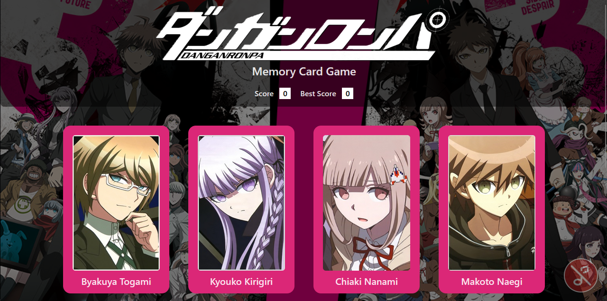
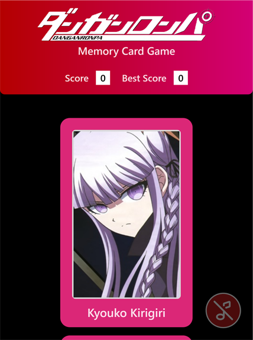

# Memory Card Game feat. Danganronpa

A board-type memory game that built in React. This game challenges user to click any of card until they don't get a same one twice.

The score increases when each card being clicked, and the 'Best Score' keeps track of the highest score achieved during the round. The cards will shuffle each time a card is clicked.



_Desktop Preview_



_Mobile Preview 1_


_Mobile Preview 2_

## About API 💡

This game uses anime/game characters from Danganronpa 1 & 2 (technically also 3) and uses Jikan API to retrieve images and information. For more details about this API visit [Jikan](https://jikan.moe/).

## Structure of App 🧩

1. A board game that contained 8 cards to get clicked.
2. Current score and best score in every round.

## Features 🚀

- When the user clicks one of the cards, that one will be shuffle and get 1 score.
- If the user clicks a card and get same one as an old one, the game round will end and the score will reset back to 0. The user can start again while keeping the best score from the last round.
- As current round best score is bigger than older one, it will be updated with the bigger one.
- Auto scroll to the top when the game round is over.

## Installation 🛠️

1. Clone this repository.

```
git clone git@github.com:tingtung46/memory-card.git
```

2. Navigate to the project directory.

```
cd memory-card
```

3. Install all dependencies.

```
npm install
```

4. Run the dev server to display the project.

```
npm run dev
```

## Special Thanks and Credit ❤️

[Kazutaka Kodaka](https://x.com/kazkodaka?t=uzNpRrWpMm9NDFCkSeLpUA&s=09), creator of Danganronpa Series for creating awesome mystery games and anime of this series!

機会があれば、ダンガンロンパ以外の他のミステリー原作を楽しみにしています! 😊
